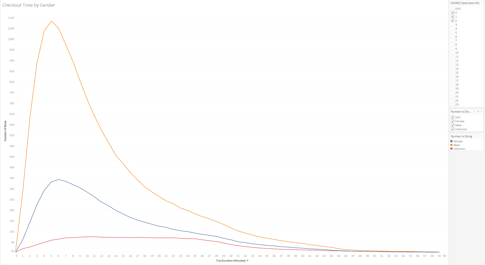
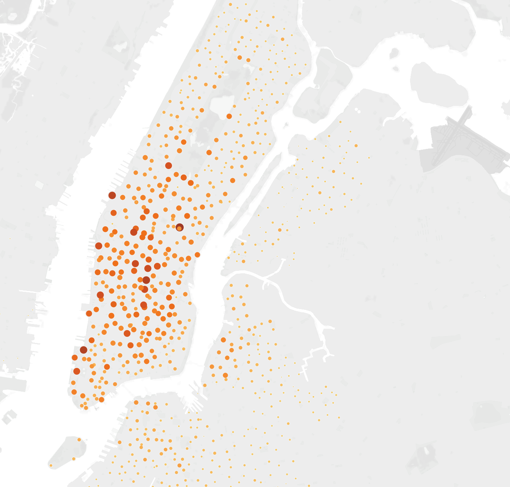

# Bike_Sharing

## Resources
*   Data Source: Citi Bike Trip Data for August 2019 - [Link to Source Site](https://s3.amazonaws.com/tripdata/index.html)
*   Software:
        *   Tableau Public 2021.4
        *   Python 3.9.7
        *   Jupyter Notebook 6.4.5
        *   Anaconda 4.11.0
        *   Visual Studio Code 1.63.2

## Overview
The purpose of this analysis was to look into the treads of NYC Citi Bike rentals to find insights for a similar business in Des Moines, IA.

## Results

[Link to the Tableau Public Dashboard](https://public.tableau.com/app/profile/kevin.d.brian/viz/Bike_Sharing_16491210938780/Story1?publish=yes)

To start, the data had a column for `tripduration` that needed to be converted to a datetime format, this was done using python and jupyter notebooks.

#### Original and Converted tripduration Columns        
______

Using the data, converted `tripduration_dt` column, and Tableau, several visualizations were created to gather ideas of user trends to help the new business

#### Checkout Time for Users

This graph shows that the typical trip duration is between 2 and 10 minuets.

#### Checkout Time by Gender

This graph shows that trip duration does not differ much between men and women. 

#### Trips by Weekday per Hour

This heatmap shows that most trips begin around the hours of 8am and 6pm.

#### Trips by Gender(Weekdays per Hour)
.png)
This heatmap shows that these popular start times do not differ much between men and women.

#### Trips by Gender by Weekday

This heatmap shows that most bike sharing users are subscribers.

#### Top Starting and Ending Locations
##### Starting

##### Ending

These maps show the most popular starting and ending locations. They show that the bikes/stations in high population density areas (within the city) are the most used.

## Summary

The results of these graphs/maps show a few things to us as we begin planning out the bike sharing business in Des Moines. From what we can see, the bikes seem to be used by people commuting to and from work in the morning and evening. For these people, the distance is short enough to not use other forms of transportation (like car, bus, or train) by long enough to not want to walk. These bikes are the perfect form of transportation then! And since these people use them basically twice a day, they subscribe to the service as evidenced by our visualization.

For future analysis it would be a good idea to think about bike usage throughout the year rather than during the most popular times. I would assume that usage drops dramatically during winter months. 

Including weather data too may also help with predicting bike usage, like if rain/snow is in the forecast how much does that affect rentals? 

Lastly, including birth year of riders may help narrow down specifically to whom these bikes most appeal so that when the Des Moines business starts up the marketing can be better focused.
